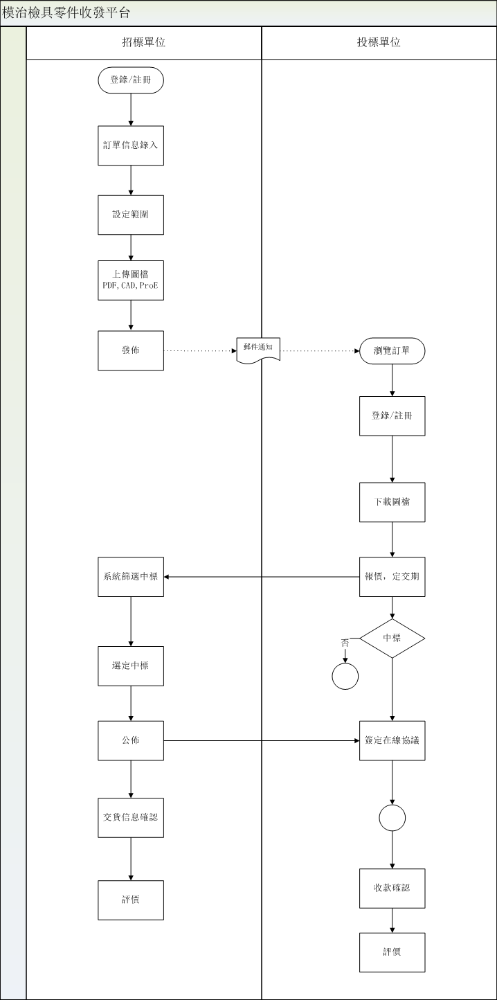
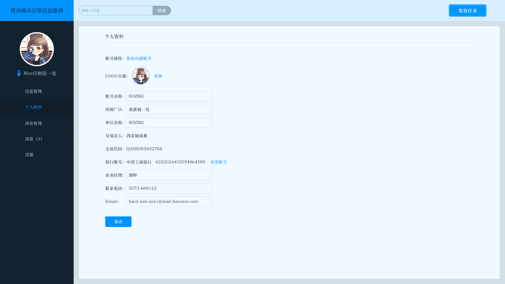
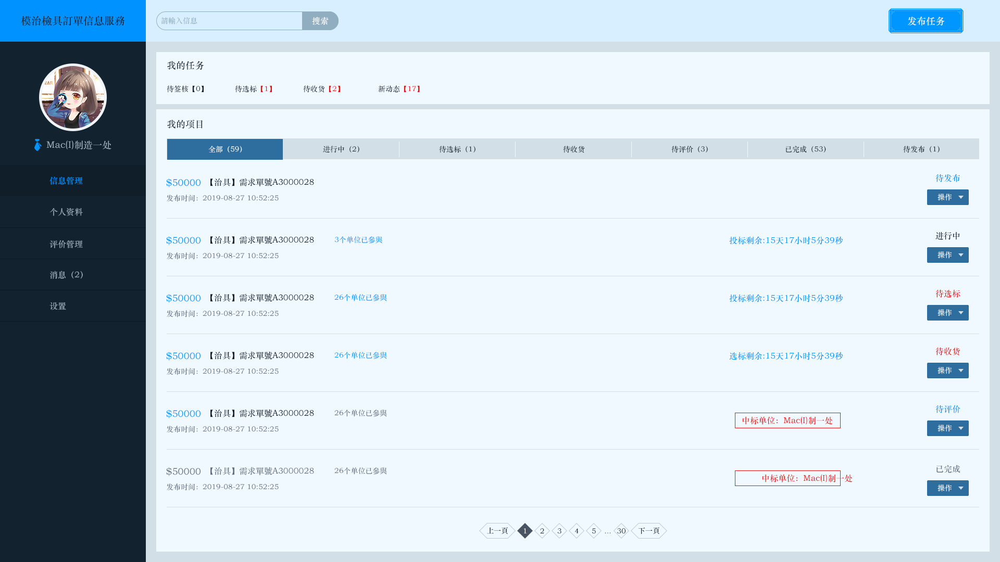
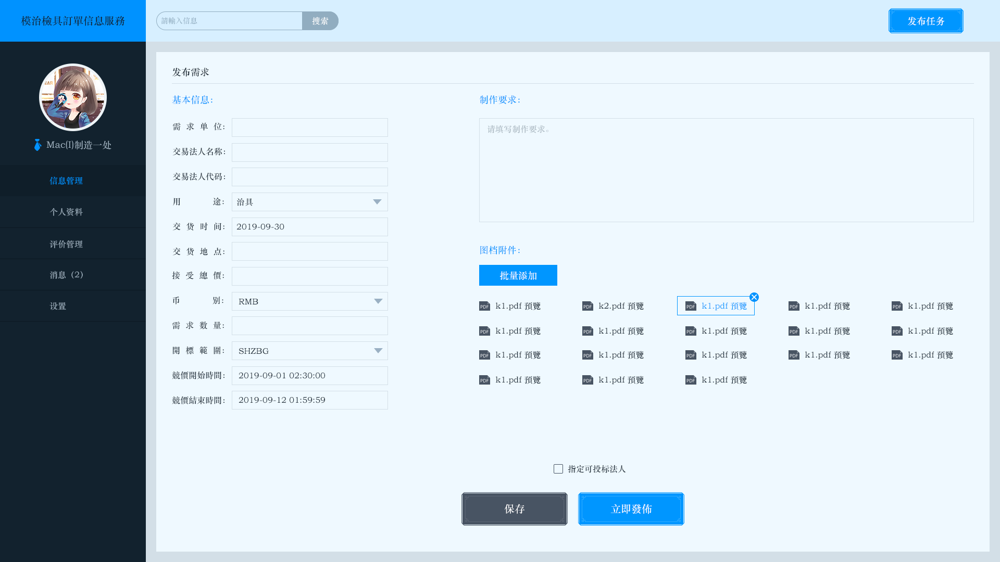
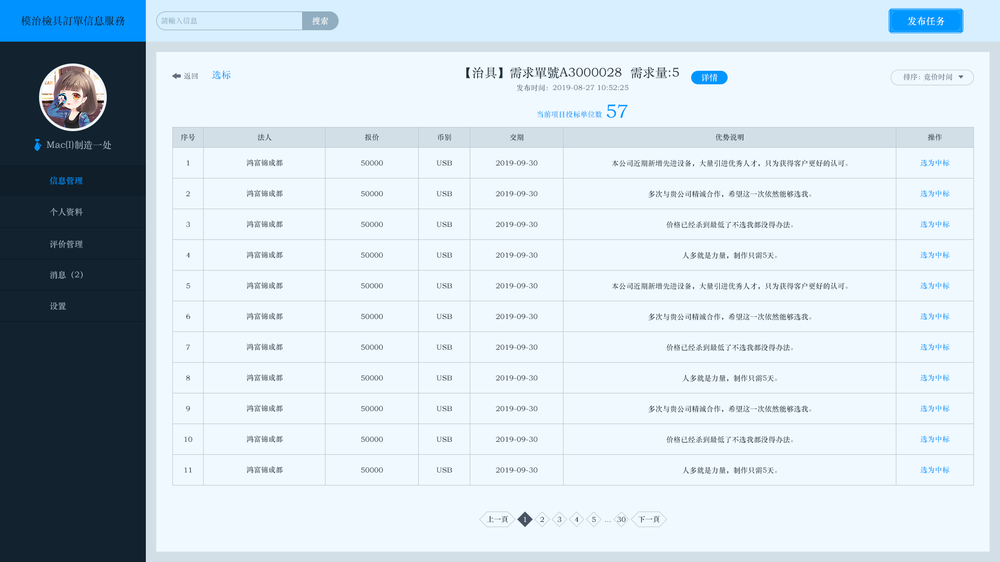
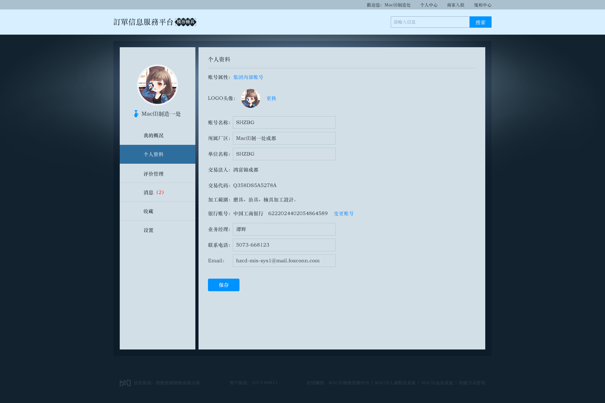
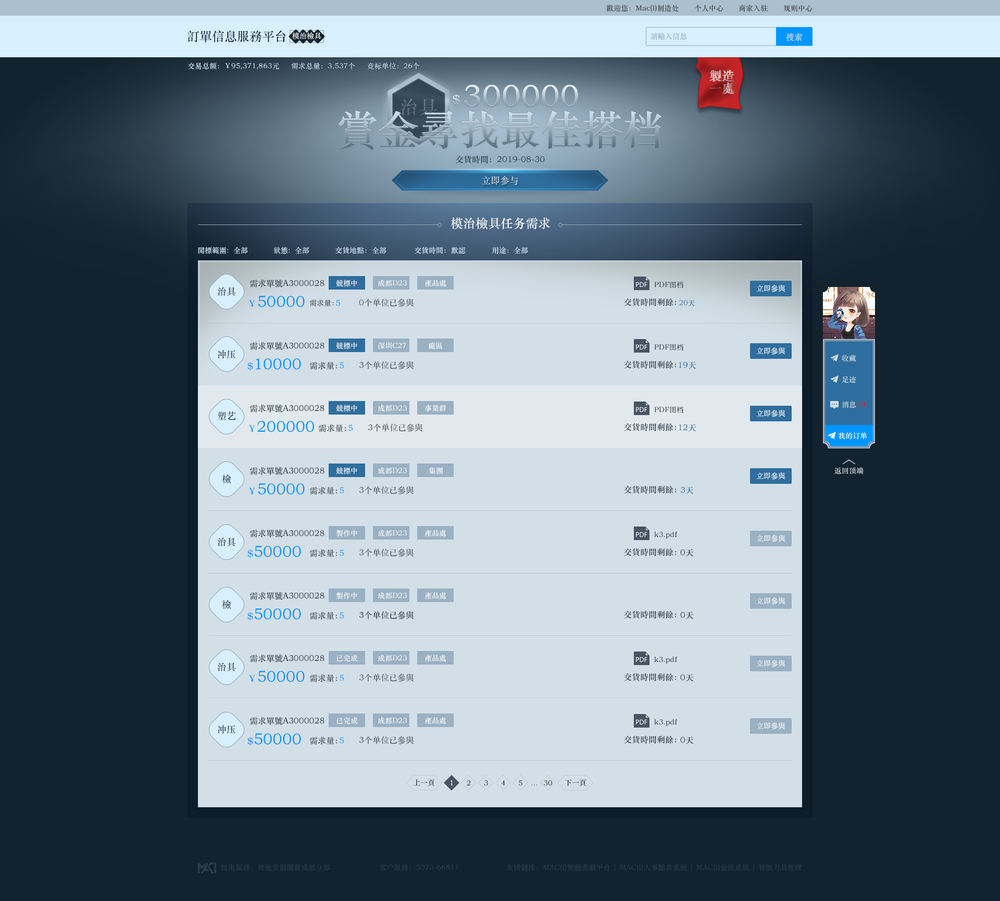
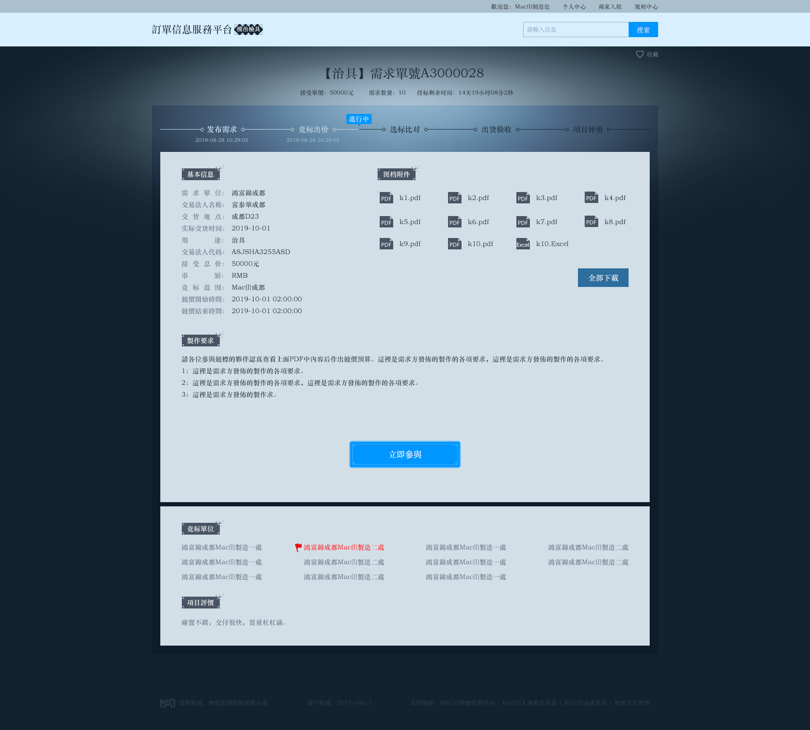
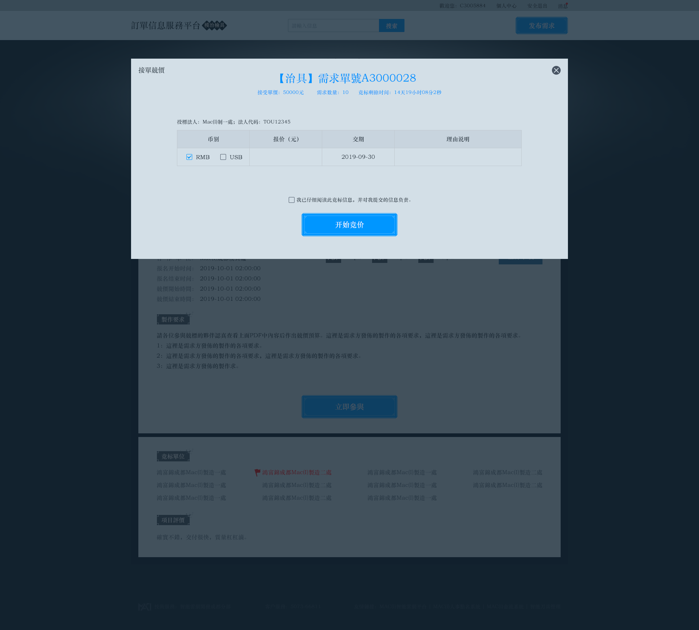

# 模治具零件訂單信息服務平臺
## 目的
通過平臺將模治檢具零件訂單信息公開、以線上開標方式確定交易對象和單價，引導集團內機加資源實現更快，更廣的自由調配。
## 參與角色
* 1、產工  
* 2、模治檢具加工廠  
## 權限
系統權限及訂單權限分開  
## 流程
  
## 模塊
* 1、登錄/註冊
* 2、消息管理中心  
接受各種任務消息通知  
* 3、訂單管理  
新增訂單，保存，發佈，當前狀態。  
* 4、瀏覽訂單   
瀏覽正在招標訂單，登錄可投標訂單
* 5、我的訂單  
可查看我的中標訂單
## 頁面
### 發單個人資料

### 訂單管理  
  
##### 發佈訂單

##### 選擇中標
  
### 接單個人資料
  
### 瀏覽訂單
  
##### 1查看詳情
  
##### 2競標
  

